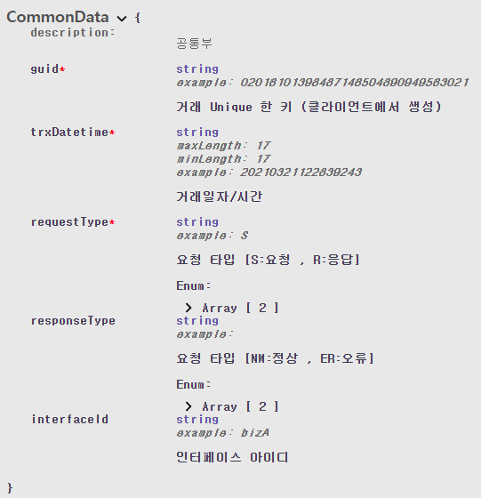
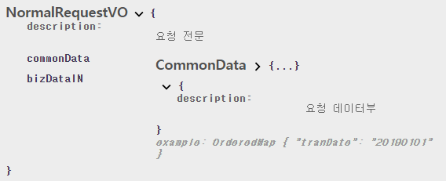
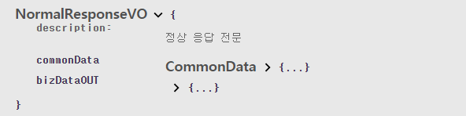
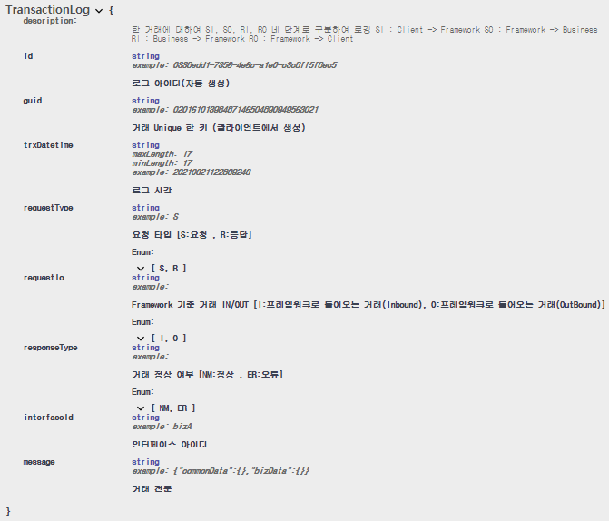
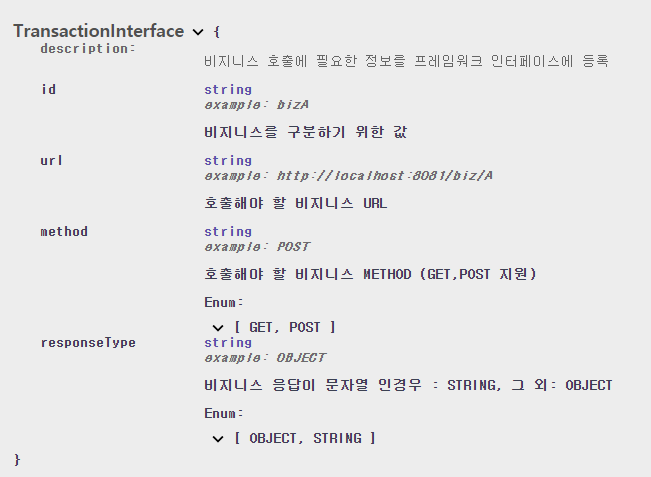

# 조회용 어플리케이션 프레임워크

조회전용 어플리케이션을 위한 어플리케이션 프레임워크의 구조를 설계하고 구현 합니다. FW 레이어와 BIZ 레이어가 분리되어 있으며, BIZ 개발자가 비지니스 처리에만 집중할수 있도록 FW 에서 서비스 Flow 및 기능을 제공합니다.

## 개발 환경

* Java8
* UTF-8
* Spring-Boot 2.4.0
* H2
* Maven


## 사용한 오픈 소스

| 오픈 소스                     | 
| ------------------------------ | 
| spring-boot-starter-data-jpa   | 
| spring-boot-starter-web        | 
| spring-boot-starter-validation | 
| spring-boot-starter-jdbc       | 
| h2                             | 
| lombok                         | 
| springdoc-openapi-ui           | 
| jackson-mapper-asl             | 
| spring-boot-starter-test       | 


##  빌드 및 실행 

* 어플리케이션 실행(프로젝트 root경로에서 실행)   
  ``C:\git\framework > mvnw spring-boot:run``

* Swagger-UI URL  
  [http://localhost:8081/swagger-ui.html](http://localhost:8081/swagger-ui.html)

* H2 콘솔 URL  
  [http://localhost:8081/h2-console](http://localhost:8081/h2-console)

## 테스트 

Swagger-UI에서 [Try it out] -> [Execute]를 통하여 API를 호출할 수 있습니다.  

#### STEP1. 초기 데이터 생성  

**```POST``` /mng/ini**  

* Framework에 BizLayer에 대한 거래 인터페이스 데이터 insert
  * FW_TRANSACTION_INTERFACED
* 테스트를 위한 Biz샘플 데이터 insert
  * BIZ_TRANSACTION 
  * BIZ_PRODUCTS 
  * BIZ_PRODUCTS 
* Request

```
No Request Body
```

* Response

```
SUCCESS
```

#### STEP2. client guid 생성    

**```GET``` /mng/guid**  

* 생성한 guid를 거래테스트에서 사용
* * Request

```
No Request Body
```

* Response

```
SUCCESS
```

#### STEP3. Framework Layer End-Point 호출

**```POST``` /fw**  

* 비지니스 A

  * 정상 거래 테스트

    * Request

    ```
    {
      "commonData": {
        "guid": "02016101398487146504890949563021",
        "trxDatetime": "20210321122839243",
        "requestType": "S",
        "responseType": "",
        "interfaceId": "bizA"
      },
      "bizDataIN": {
        "tranDate":"20190101"
      }
    }
    ```

    * Response  

    ```
    {
      "commonData": {
        "guid": "02016101398487146504890949563021",
        "trxDatetime": "20210321122839243",
        "requestType": "R",
        "responseType": "NM",
        "interfaceId": "bizA"
      },
      "bizDataOUT": {
        "list": [
          {
    	"tranId": "10001",
    	"tranDate": "20190101",
    	"tranTime": "120101",
    	"inoutType": "I",
    	"printContent": "스타벅스",
    	"tranAmt": "10000"
          },
          {
    	"tranId": "10002",
    	"tranDate": "20190101",
    	"tranTime": "120101",
    	"inoutType": "I",
    	"printContent": "스타벅스",
    	"tranAmt": "10000"
          }
        ]
      }
    ```

  * 오류 거래 테스트

    * Request

    ```
    {
      "commonData": {
        "guid": "02016101398487146504890949563021",
        "trxDatetime": "20210321122839243",
        "requestType": "S",
        "responseType": "",
        "interfaceId": "bizA"
      },
      "bizDataIN": {
      }
    }
    ```

    * Response  

    ```
    {
      "commonData": {
        "guid": "02016101398487146504890949563021",
        "trxDatetime": "20210325014044689",
        "requestType": "R",
        "responseType": "ER",
        "interfaceId": "bizA"
      },
      "bizDataERR": {
        "errorCode": "BZ001",
        "errorMessage": "business layer internal server error [500 : [{\"code\":\"ER001\",\"message\":\"tranDate 누락\"}]]"
      }
    }
    ```


* 비지니스 B

  * 정상 거래 테스트

    * Request	

    ```
    {
      "commonData": {
        "guid": "27219962563392962090840127134881",
        "trxDatetime": "20210321122839243",
        "requestType": "S",
        "responseType": "",
        "interfaceId": "bizB"
      },
      "bizDataIN": "10001"
    }
    
    ```

    * Response  

    ```
    {
      "commonData": {
        "guid": "27219962563392962090840127134881",
        "trxDatetime": "20210321122839243",
        "requestType": "R",
        "responseType": "NM",
        "interfaceId": "bizB"
      },
      "bizDataOUT": "10000"
    }
    ```

* 비지니스 C

  * 정상 거래 테스트

    * Request

    ```
    {
      "commonData": {
        "guid": "39718442043902569086688658531818",
        "trxDatetime": "20210321122839243",
        "requestType": "S",
        "responseType": "",
        "interfaceId": "bizC"
      },
      "bizDataIN": {
        "prdNm":"미니"
      }
    }
    ```

    * Responose

    ```
    {
      "commonData": {
        "guid": "39718442043902569086688658531818",
        "trxDatetime": "20210321122839243",
        "requestType": "R",
        "responseType": "NM",
        "interfaceId": "bizC"
      },
      "bizDataOUT": {
        "list": [
          {
    	"idNo": "10001",
    	"prdCd": "MINI",
    	"prdNm": "미니"
          },
          {
    	"idNo": "10002",
    	"prdCd": "MINI",
    	"prdNm": "미니"
          }
        ]
      }
    ```

  * 오류 거래 테스트

    * Request

    ```
    {
      "commonData": {
        "guid": "39718442043902569086688658531818",
        "trxDatetime": "20210321122839243",
        "requestType": "S",
        "responseType": "",
        "interfaceId": "bizC"
      },
      "bizDataIN": "미니"
    }
    ```

    * Responose

    ```
    {
      "commonData": {
        "guid": "39718442043902569086688658531818",
        "trxDatetime": "20210325022928780",
        "requestType": "R",
        "responseType": "ER",
        "interfaceId": "bizC"
      },
      "bizDataERR": {
        "errorCode": "FL005",
        "errorMessage": "요청 데이터부 형식이 부적절합니다.[json 형식 지원, 요청데이터: 미니]"
      }
    }
    ```


* 비지니스 D  

  * 정상 거래 테스트

    * Request
      ```
       {
        "commonData": {
          "guid": "82097965703068010856468600657355",
          "trxDatetime": "20210321122839243",
          "requestType": "S",
          "responseType": "",
          "interfaceId": "bizD" 
        },
        "bizDataIN": {
          "sql":"select * from biz_transaction where tran_id = '10002'" 
        } 
      }
      ```
     * Response
      ```
       {
        "commonData": {
          "guid": "82097965703068010856468600657355",
          "trxDatetime": "20210325114222159",
          "requestType": "R",
          "responseType": "NM",
          "interfaceId": "bizD"
        },
        "bizDataOUT": [
          {
            "TRAN_ID": "10002",
            "INOUT_TYPE": "I",
            "PRINT_CONTENT": "스타벅스",
            "TRAN_AMT": "10000",
            "TRAN_DATE": "20190101",
            "TRAN_TIME": "120101"
          }
        ]
      }
      ``` 


      


## 요구사항 및 문제해결

* FW는 End-Point 를 제공하며, Client 와 HTTP 로 통신합니다. & Input/Output 은  JSON 타입으로 설계/구현합니다.   
  **문제해결**    
  * Client <-> Framework : @RestContoller를 사용하여 Spring에서 데이터 변환 처리  
  * Framework <-> Business : ObjectMapper를 사용하여 데이터 변환 처리  
  
* Input/Output 는 공통부와 데이터부로 나누어 있으며,  (예시1) 을 참고합니다. & FW 내부에서 사용, 전달되는 데이터구조를 설계하고 적절히 구현해야 합니다.    
  **문제해결**   
  *  commonData : 공통부   
       
      
  *  bizDataIN : 요청 데이터부
  *  bizDataOUT : 정상 응답 데이터부
  *  bizDataERR : 에러 응답 데이터부
  *  NormalRequestVO : 요청 전문 (commonData + bizDataIN)  
       

  *  NormalResponseVO : 정상 응답 전문 (commonData + bizDataOUT)
       

  *  ErrorResponseVO : 에러 응답 전문 (commonData + bizDataERR)


* Input/Output 데이터 전체를 로깅합니다. 로깅방식은 자율이며, 반드시 가독성 확보가 필요합니다.  
  **문제해결**   
  * 한 거래에 대하여 SI, SO, RI, RO 네 단계로 구분하여 로깅 
    * SI : Client -> Framework 
    * SO : Framework -> Business 
    * RI : Business -> Framework 
    * RO : Framework -> Client   
     

* FW에서 BIZ 호출하는 방법을 구조화, 정형화 해야합니다.  
    **문제해결**   
  * 비지니스 호출에 필요한 정보를 프레임워크 인터페이스에 등록
     
  
* BIZ의 결과에 따라 거래의 정상/오류가 결정됩니다. (BIZ가 정상이면 정상 response, 오류이면 오류 response)  
    **문제해결**   
  * 프레임워크에서 발생하는 오류 정의
  * 에러 코드 종류    
    | 에러 코드 종류 | 설명                            |
    | -------------- | ------------------------------- |
    | FL             | Framework Layer에서 발생한 에러 |
    | BZ             | Business Layer에서 발생한 에러  |
    | ER             | 공통 에러                       |

  * 에러 코드   
    | Code  | Message                                                      |
    | ----- | ------------------------------------------------------------ |
    | FL001 | framework layer internal server error [%s]                   |
    | FL002 | interfaceId 가 누락되었습니다.                               |
    | FL003 | 해당 인터페이스를 찾을 수 없습니다. [interfaceId: %s]        |
    | FL004 | 지원하지 않는 메소드 입니다. [요청 메소드: %s, 지원 메소드: GET,POST] |
    | FL005 | 요청 데이터부 형식이 부적절합니다.[%s]                       |
    | FL006 | 응답 데이터부 형식이 부적절합니다.[%s]                       |
    | FM001 | framework manager internal server error [%s]                 |
    | FM002 | interfaceId 가 누락되었습니다.                               |
    | FM003 | 해당 인터페이스를 찾을 수 없습니다. [interfaceId: %s]        |
    | BZ001 | business layer internal server error [%s]                    |
    | BZ002 | 잘못된 요청입니다. [%s]                                      |
    | ER001 | internal server error [%s]                                   |
  
* 서비스 Flow는 예시 2와 별첨을 참고합니다. (구조에 맞게 변경해도 무방)  
  **문제해결**   
  * Framework Flow  
    1. Framework Layer End-Point 호출
    2. 공통부, 데이터부 분리
    3. 내부 데이터 셋에 적재
    4. 요청 공통부+데이터부 로깅
    5. 호출할 비지니스 정보 가져오기
    6. 요청 데이터부 로깅
    7. 비지니스 호출
    8. 정상 응답 데이터부 로깅
    9. 정상 응답 공통부 데이터 생성
    10. 정상 응답 전문 생성
    11. 응답 공통부+데이터부 로깅 12 client에 응답

* BIZ는 하나이상의 RDMS 에 접근하며, FW에서는 확장성 있게 데이터소스를 관리해야 합니다.  
  **문제해결**   
  * 인터페이스 속성에 데이터소스 정보 저장
  * 데이터소스 관련 속성
    | 키 | 값                            |
    | -------------- | ------------------------------- |
    | transaction.mode             | jdbc |
    | datasource.driver.class.name             | org.h2.Driver  |
    | datasource.url             | jdbc:h2:mem:fw;                       |
    | datasource.username             | fw                      |
    | datasource.password             |                      |


  * 동적 관리
  
* 해당 FW는 조회용으로 BIZ 레이어에서 데이터의 변경이 발생하지 않도록 트랜잭션 관리가 필요합니다.   
  **문제해결**   
  * 선언적 관리   
    ```
     @Transactional(readOnly = true)
    ```
  * 트랜젝션 동적 관리   
    * 인퍼테이스 속성 설정 : [key:datasource.key , value: true]  
    * DataSource DefaultReadOnly 설정
    * JdbcTemplate Connection ReadOnly 설정    


* 운영관리를 위한 기능이 필요합니다. (화면은 없어도 무방)   
  **문제해결**   
  * 로그 목록 조회
  * 인터페이스 목록 조회
  * 인터페이스 속성 목록 조회
  * 인터페이스 속성 추가/수정
 


